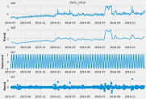
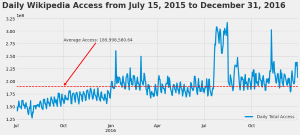

# **Web Traffic Flow Prediction**

**Iconiq Inc / Iconiq Skills India Pvt. Ltd**  
601 Allerton Street, Redwood City, CA 94110

## Problem Statement:

This project aims to predict the traffic of Wikipedia pages based on their historical traffic data. The data consists of page traffic information from the Wikipedia website, where each row in the dataset corresponds to a particular article, and each column corresponds to a particular date.

This model will help the Wikipedia team to plan their resources efficiently, as they can predict the number of visits to their website in advance. It will also help them identify popular and trending pages and provide better user experiences by directing more resources.

## Data Description

### Data Link

The data is provided in two files, `web_traffic_data.csv` and `articles_data.csv`. The `web_traffic_data.csv` file contains traffic data, where each row represents a particular article and each column represents a particular date. The page names contain the Wikipedia project, access, and agent types. The `articles_data.csv` file maps the page names and the shortened Id column used for prediction.

## Tasks

1. **Data cleaning**: The dataset contains missing values, so the first task would be to clean the data by filling in the missing values or removing rows with missing values.

2. **Exploratory data analysis**: Conduct exploratory data analysis to gain insights into the dataset. This can include visualizations, statistical summaries, and correlation analyses.

3. **Time series modeling**: Using time series models to forecast the traffic flow for each article. Possible models include ARIMA, SARIMA, and Prophet.

4. **Model evaluation**: Evaluating the performance of the time series models using metrics such as R2, MSE, and RMSE.

5. **Feature engineering**: Creating additional features such as lagged variables, moving averages, and seasonal indicators to improve the forecasting accuracy of the models, if needed.

6. **Prediction intervals**: Calculate prediction intervals to measure uncertainty around the traffic flow forecasts. Hint: Confidence Intervals: Prediction intervals measure the uncertainty around the forecasted traffic flow values. They provide a range within which the actual traffic flow is expected to fall with a certain level of confidence.

7. **Visualization**: Creating visualizations to communicate the findings and insights from the analysis, such as line plots, heatmaps, and scatterplots.

# Wikipedia_Traffic_Analysis
